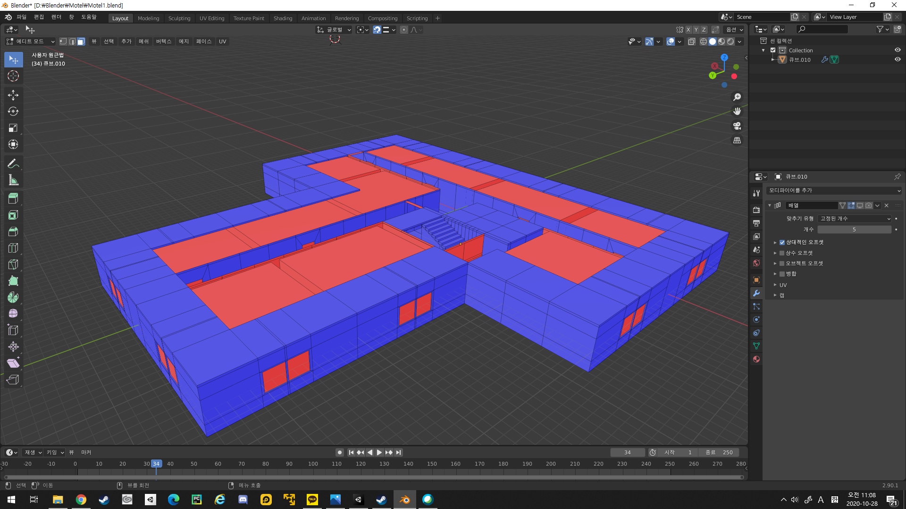

# 1주차 진행도
## 건물 모델링 - 20%
### 메인이 되는 플레이 공간 구현

## 캐릭터 움직임 - 50%
### 마우스와 WASD를 이용한 이동 구현
 

## 손전등 - 80%
### 손전등은 거의 완성했다. 처음 플레이어는 손전등이 없는 상태로 시작하고 아이템을 습득하면 사용가능
 

## 쉐이더 - 40%
### VHS느낌의 쉐이더를 만들고싶다 R,B채널 번짐 미구현  

<iframe width="1237" height="696" src="https://www.youtube.com/embed/IIRFHcco83o" frameborder="0" allow="accelerometer; autoplay; clipboard-write; encrypted-media; gyroscope; picture-in-picture" allowfullscreen></iframe>
