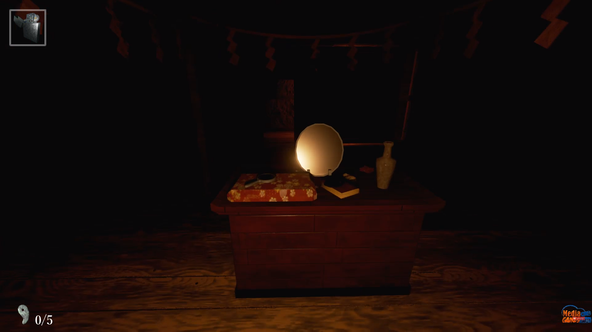
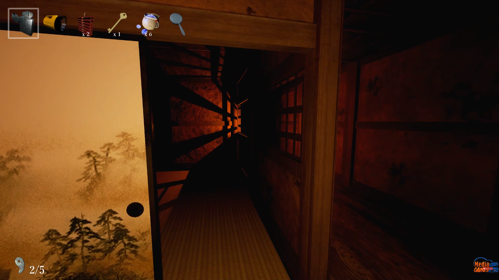
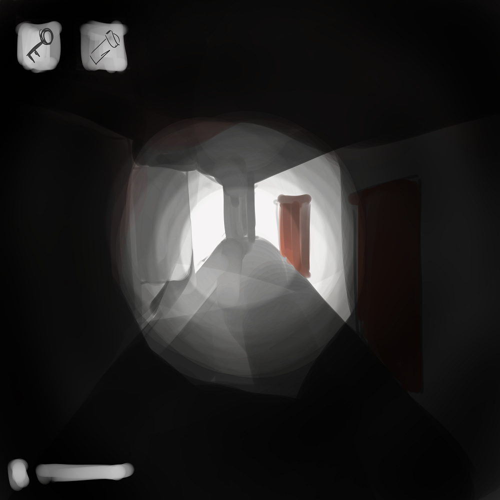
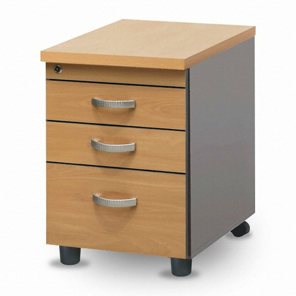
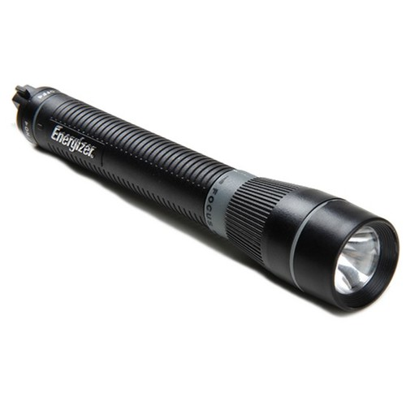
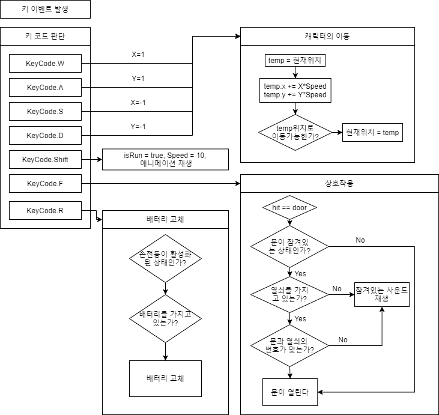
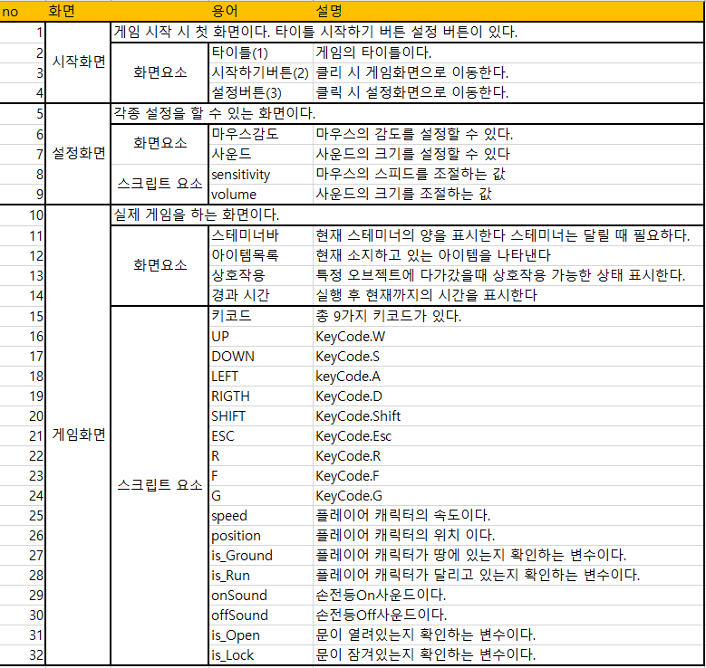
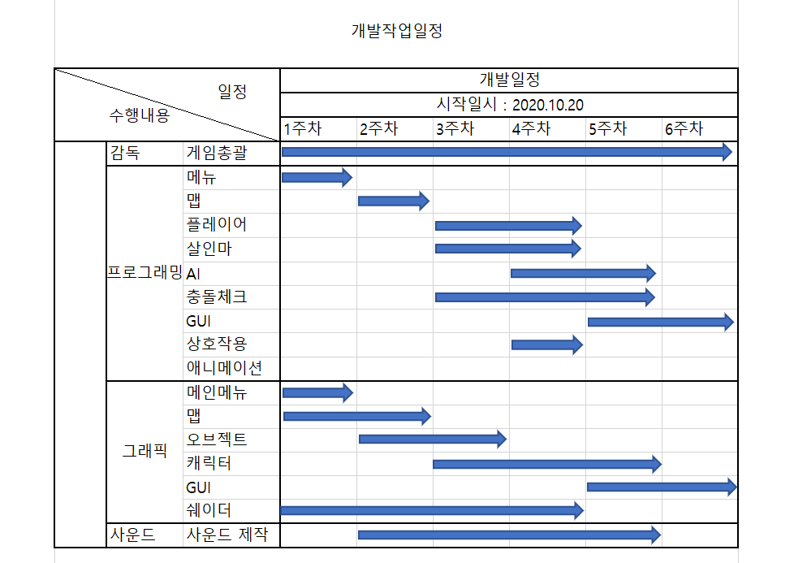
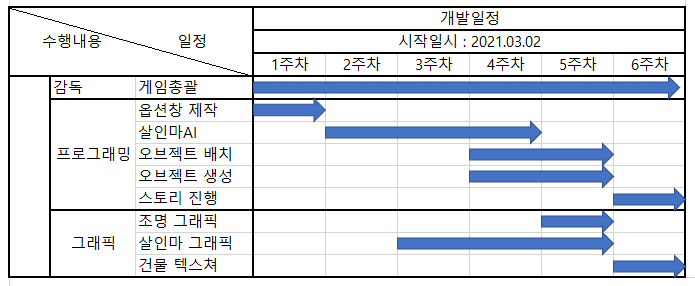

[1.컨셉](#컨셉)  
[2.관련 이미지 & 동영상](#관련-이미지--동영상)  
[3.대표 이미지](#대표-이미지)  
[4.컨셉 & 대표이미지 기반 작품묘사](#컨셉--대표이미지-기반-작품묘사)  
[5.게임제목 구성 요소](#게임제목-구성-요소)  
[6.게임 시스템 디자인](#게임-시스템-디자인)  
[7.개발 요구사항 & 흐름도](#개발-요구사항--흐름도)  
    10-1. [1주차](files/1주차.md)  
    10-2. [2주차](files/2주차.md)  
    10-3. [3주차](files/3주차.md)  
    10-4. [4주차](files/4주차.md)  
    10-5. [5주차](files/5주차.md)  
    10-6. [6주차](files/6주차.md)  
    10-7. [7주차](files/7주차.md)  
    10-8. [8주차](files/8주차.md)  
    10-9. [9주차](files/9주차.md)  
    10-10. [10주차](files/10주차.md)  
    10-11. [11주차](files/11주차.md) 
    10-12. [12주차](files/12주차.md)  
    10-13. [13주차](files/13주차.md)  
    10-14. [14주차](files/14주차.md) 
    10-15. [15주차](files/15주차.md) 

# [게임명 : ShadowMotel]  
 -3D공포게임  
 
# [컨셉]
## 메인컨셉 : 열쇠
- 한 남성이 어떤 모텔에 갇혔고 여자친구는 살인마에게 살해됐다.
- 시체를 뒤져서 열쇠를 찾고 모텔을 돌아다니며 탈출힌트를 찾아보자.

### 서브 컨셉 1 : 사운드
- 리얼한 사운드를 이용해 몰입감 있게 플레이할 수 있다.
- 상황별 사운드이펙트로 긴장감을 준다.

### 서브 컨셉 2 : 간단함
- 작은 맵 안에서 가볍게 즐기는 게임이다.
- 건물안에서 랜덤하게 열쇠가 생성된다.

### 서브 컨셉 3 : 카메라 이펙트
- 카메라 이펙트를 만들어 게임의 공포효과를 더한다.

### 서브 컨셉 4 : 컷씬
- 플레이 중간중간 마다 컷씬을 넣어서 지루하지 않게 한다.

### 서브 컨셉 5 : 탈출
- 주변의 방해를 이겨내고 잠겨있는 문을 열어 탈출에 성공해보자 

  
# [관련 이미지 & 동영상]
- 이미지  

- 동영상

  
# [대표 이미지]

  
# [컨셉 & 대표이미지 기반 작품묘사]
> ### 대표이미지 기반 : 불이 다 꺼진 모텔 안. 주인공은 손전등 하나만 가지고 깜깜한 복도를 지나다닌다. 옆에서 들려오는 쇠 긁히는 소리. 그리고 초록 불빛

  
# [<게임제목> 구성 요소]

- Shadow Motel

 

## 1. 메커니즘

[도전 과제]
1) 건물 곳곳에 숨겨져 있는 열쇠를 찾아서 탈출하라  
2) 건물안에 살인마가 있다. 안 잡히게 조심하자.  

[재미 요소]
1) 후레쉬는 시간이 지날수록 배터리가 단다.  
2) 방마다 숨을 수 있는 공간이 있다.  
3) 다시 시작할 때 마다 아이템의 위치가 달라진다.  

 

## 2. 이야기

[시작]  
비가 내리는날, 남자와 여자가 한적한 시골에서 차를 타고 가고
있다. 명절이라 시골댁에 내려왔다 올라가는 길이었다. 그러던 
중, 쭉 뻗어있던 도로가 이상하게 변하더니 온통 갈대밭으로 펼
쳐진 곳이 나왔다. 비가 매우 거세게 오는와중 도로에 무언가를
 발견하고 급하게 차의 방향을 틀다 도랑에 빠지게 된다. 둘은 차
에 내려 깜깜한 밤에 길을 헤매던중 어느 모텔에 들어섰다. 무뚝
뚝한 주인이 데스크에서 열쇠를 건네주고 방으로 들어갔다.

[카메라 관점]  
- 현실감과 공포감을 주기 위해서 1인칭 시점으로 결정
- 카메라 노이즈 효과를 통해서 분위기 극대화. 

 

## 3. 미적요소

[디자인][컬러]  
- 공포게임에 맞는 어둡고 차가운 컬러
- 옛날느낌이나는 촌스러운 채도
- 각종 노이즈효과
[음향]  
- 조용하게 분위기를 잡아주는 주변음
- 살인마의 위치를 알려주는 쇠 긁히는소리
- 주인공의 발소리
- 문여는 소리
	
 

## 4. 기술 
1) AI   
2) NAVIGATION  
3) SHADER  
4) UNIVERSAL RENDER PIPELINE  
4) POST PROCESS  
6) MODELING  

 

# [게임 시스템 디자인]

## 1. 게임 오브젝트 분해  

|연번|오브젝트 이름|오브젝트 이미지|  
|:---:|:---:|:---:|  
|1|문||  
|2|서랍||  
|3|손전등||  
|4|열쇠||

  

## 2.파라미터 뽑아보기
 

### 1) 오브젝트 이름 : 문
 

|속성|속성 값|설명|비고|  
|:---:|:---:|:---:|:---:|  
|상태1 (is_Open)|false|문이 열려있는지 알려주는 파라미터||  
|상태2 (is_Lock)|false|문이 잠겨있는지 알려주는 파라미터||
|고유 번호|1~30|문과 열쇠의 번호가 같아야 열 수 있다||
|사운드|Open사운드|문을 열 때 재생할 사운드||
|사운드|Close사운드|문을 닫을 때 재생할 사운드||

  

### 2) 오브젝트 이름 : 서랍
 

|속성|속성 값|설명|비고|  
|:---:|:---:|:---:|:---:|  
|상태1 (is_Open)|false|서랍이 열려있는지 알려주는 파라미터||  
|상태2 (is_Lock)|false|서랍이 잠겨있는지 알려주는 파라미터||
|사운드|Open사운드|서랍을 열 때 재생할 사운드||
|사운드|Close사운드|서랍을 닫을 때 재생할 사운드||

  

### 3) 오브젝트 이름 : 손전등
 

|속성|속성 값|설명|비고|  
|:---:|:---:|:---:|:---:|
|소지 배터리 최댓값|4|배터리 소지 최댓값||
|소지 배터리 갯수|2|현재 소지하고 있는 배터리 갯수||
|배터리 양 최댓값|10|갈아 끼운 배터리 양의 최댓값||    
|배터리 감소 속도|1.0|사용할 때 배터리가 감소하는 속도||      
|토글 키|KeyCode.R|손전등을 켜고 끌 수 있는 버튼||
|리로드 키|KeyCOde.F|손전등 배터리를 갈아 끼울 수 있는 버튼||
|사운드|On사운드|손전등을 켤 때 재생할 사운드||
|사운드|Off사운드|손전등을 끌 때 재생할 사운드||

  

### 4) 오브젝트 이름 : 열쇠
 

|속성|속성 값|설명|비고|  
|:---:|:---:|:---:|:---:|  
|고유 번호|1~30|문과 열쇠의 번호가 같아야 열 수 있다||
|사운드|열쇠 사운드|열쇠를 사용할 때 재생할 사운드||

  

## 3.행동 뽑아보기
 

### 1) 오브젝트 이름 : 문
 

|행동|설명|  
|:---:|:---:|  
|문 열기|닫혀있는 문을 연다.|  
|문 닫기|열려있는 문을 닫는다.|  
|자물쇠 열기|잠겨있는 문을 푼다.|
|사운드 재생|사운드를 재생한다.|  

  

### 2) 오브젝트 이름 : 서랍
 

|행동|설명|  
|:---:|:---:|  
|서랍 열기|닫혀있는 서랍을 연다.|  
|서랍 닫기|열려있는 서랍을 닫는다.|  
|사운드 재생|사운드를 재생한다.|  

  

### 3) 오브젝트 이름 : 손전등
 

|행동|설명|  
|:---:|:---:|  
|배터리 갈아끼우기|배터리를 갈아끼운다|  
|손전등 들기|손전등을 활성화|  
|사운드 재생|사운드를 재생한다.|  
|배터리 업데이트|인터페이스에 표시할 배터리 양을 업데이트 해준다.|  
|배터리 감소|배터리를 감소시킨다.|  

  

### 4) 오브젝트 이름 : 열쇠
 

|행동|설명|  
|:---:|:---:|  
|고유 번호|1~30|  

  

## 4.상태 뽑아보기
 

### 1) 오브젝트 이름 : 문
 

|현상태|전이상태|전이조건|  
|:---:|:---:|:---:|  
|문 열려있음|문 닫혀있음|플레이어의 상호작용에 의해 가능|  
|문 닫혀있음|문 열려있음|문이 잠겨져 있지 않고 플레이어의 상호작용에 의해 가능|  

  

### 2) 오브젝트 이름 : 서랍
 

|현상태|전이상태|전이조건|  
|:---:|:---:|:---:|  
|서랍 열려있음|서랍 닫혀있음|플레이어의 상호작용에 의해 가능|  
|서랍 닫혀있음|서랍 열려있음|서랍이 잠겨져 있지 않고 플레이어의 상호작용에 의해 가능|  

  

## 5.플레이어 캐릭터 속성
 

|속성|속성 값|설명|비고|  
|:---:|:---:|:---:|:---:|  
|상호작용 키|KeyCOde.F|문을 열고 닫을 수 있는 키다.||  
|마우스 민감도|0~100|마우스의 민감도를 설정한다.||
|위치정보|Transform|캐릭터 움직임에 필요한 속성||
|스피드|10|캐릭터가 얼마나 빠르게 움직일 것인가||
|isGrounded|true|캐릭터가 바닥에 있는 지 검사하는 속성||
|isRun|true|캐릭터가 달리는지 검사하는 속성||
|스테미너|0~100|플레이어가 달리기 위해 필요한 스테미너||

  

## 6.게임의 규칙
 
 
### 1)핵심규칙  
열쇠의 위치는 랜덤으로 생성된다  
살인마는 건물 안을 끝없이 돌아다닌다.  
플레이어는 살인마에게 손을 댈 수 없다.  
살인마에게 잡히면 게임이 종료된다.  
탈출을 하려면 특정열쇠를 획득 해야한다.  

### 2)보조규칙  
살인마는 빛이 보이면 쫒아온다.  
살인마는 소리가 들리면 쫒아온다.  
플레이어는 스테미너가 있다.  
살인마는 주변에 오면 망치를 끄는 소리가 들린다.  
잠겨있는 문은 열쇠가 필요하다.  
서랍속에 열쇠가 들어있을 수 있다.  

# [개발 요구사항 & 흐름도]  
## 01 요구사항  
### 게임의 요구사항  
### 6주차
● ~~시작화면, 게임화면, 게임 오버 화면, 옵션 화면 네가지 화면이 있다.~~  
● ~~시작화면에는 시작하기와 옵션 두가지 버튼이 존재한다.~~  
● ~~옵션을 누르면 옵션화면으로 이동한다.~~  
● ~~옵션화면에서는 마우스 감도와 사운드크기를 조절할 수 있다.~~  
● ~~옵션화면에서는 돌아가기 버튼이 있고 클릭 시 시작화면으로 이동한다.~~  
● ~~시작화면에서 시작하기를 누르면 게임화면으로 변경된다.~~  
● ~~게임화면에는 현재 점수 경과한 시간, 자신이 가지고 있는 아이템, 현재 선택한 아이템이 표시 된다.~~  
● ~~플레이시점은 1인칭 시점이고 wasd와 마우스를 이용해 조작이 가능하다.~~  
● ~~Shift키로 달릴수있다. 이때 스태미너가 달고 스테미너가 없으면 달릴 수 없다.~~  
● ~~F키로 문을 열거나 닫을 수 있다.잠긴 문은 맞는 열쇠를 들고 상호작용을 해야한다.~~  
● ~~마우스 좌클릭으로 서랍을 열고 닫거나 아이템을 잡고 사용할 수 있다.~~  
● ~~마우스 우클릭로 손전등을 꺼낼 수 있다.~~  
● ~~게임의 종료는 살인마에게 붙잡히면 끝이난다.~~  
● ~~게임 종료시 종료 팝업이 뜬다. 종료팝업에는 처음화면으로 버튼이 있다.~~  
● ~~플레이어는 움직일 때마다 발 소리가 들린다.~~   
● ~~살인마는 랜덤하게 문을 열고 건물 안을 돌아다닌다.~~  
● ~~살인마는 손전등 빛이 보이면 빛을 따라간다.~~  
● ~~살인마는 주변에 10미터 안에서 소리가 들리면 소리를 따라간다.~~  
● ~~손전등은 켜고 끌 수 있고 켜있는 동안 배터리가 감소한다.~~  
● ~~방에서 서랍을 열면 랜덤으로 열쇠나 손전등 배터리를 얻을 수 있다.~~  
● ~~손전등을 든 상태일 때 R을 누르면 배터리를 교체할 수 있다. 사용한 배터리는 없어진다.~~  
● ~~살인마는 플레이어를 발견하면 스피드가 증가한다.~~  
● ~~살인마는 시야에 플레이어가 보이면 따라간다.~~

### 1년차
● ~~플레이어는 방을 돌아다니면서 탈출 열쇠를 찾아야한다.~~  
● ~~조명을 추가한다.~~  
● ~~살인마 모델링, 텍스쳐~~  
● ~~맵 텍스쳐 및 모델링 수정~~  
● ~~AI는 열려있는 방이 있으면 방 안까지 들어온다.~~  
● ~~디테일한 오브젝트를 배치한다.~~  
● 살인마가 근처에 있으면 특정 이펙트를 만든다.  
● 살인마가 플레이어를 잡으면 컷씬이 나온다.  
● ~~튜토리얼에서는 플레이어는 방안에서 시작하고 수건을 가지러 가기위해 카운터데스크로 내려간다.~~  
● ~~중간 중간 필요한 이벤트를 발생시킨다.~~  
● 플레이어는 불을 켜기위해 차단기를 찾는다.  
● 차단기를 올린 상태에서 탈출이 가능하다.  
● ~~플레이어가 수건을 갖고 다시 올라가면 불이 꺼지고 바닥에 피가 생긴다.~~
● ~~피를 쫒아서 5층까지 올라가면 처음 열쇠를 획득할 수 있다.~~
● ~~5층에 있는 열쇠를 획득하면 2층에서 살인마가 나타난다.~~
● ~~플레이어가 진행할 수 있도록 도움말 자막을 추가한다.~~

## 02 키보드 이벤트에 대한 흐름도

## 03 용어정리

## 04 2020 게임작업일정

## 05 2021 게임작업일정

